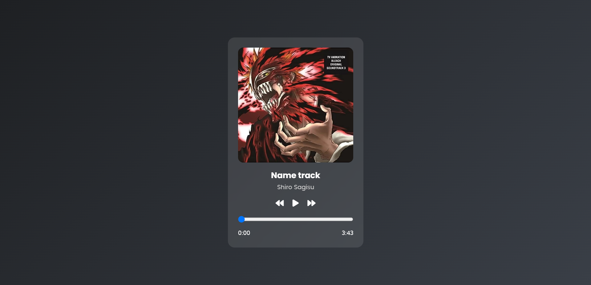

# Music Player ✨
A sleek music player web app built with HTML, CSS, and JavaScript.

## 🚀 Live Demo

Experience the site live at 👉 [Click me](https://emadn87-dev.github.io/Music-player/)

## Demo Preview 📸

## Description 📝
Simple and elegant web-based music player with play/pause controls, seek bar, and time display. Features a clean UI with responsive design.

## Features 🔥
| Feature | Description |
|---------|-------------|
| Play/Pause Control | Click to play or pause the music |
| Seek Bar | Control playback position with progress bar |
| Time Display | Shows current time and total duration |
| Responsive Design | Works on mobile, tablet, and desktop |
| Clean UI | Modern interface with attractive fonts |

## Tech Stack 🛠️
- 
- 
- 
- 
- 

## Installation 🚀
1. Clone the repo: `git clone https://github.com/EmadN87-dev/Music-player.git`
2. Open `index.html` in your browser

## Usage 🎮
- Click the play button to start/stop music
- Drag the seek bar to jump to different positions
- The time display shows current position and total duration

## License ⚖️
MIT License - See [LICENSE](LICENSE) for details.
